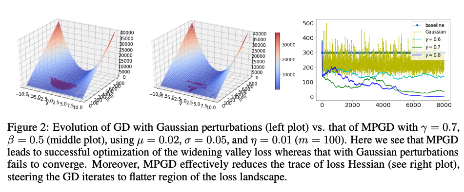

# [MPGD: Chaotic Regularization and Heavy-Tailed Limits for Deterministic Gradient Descent](https://arxiv.org/abs/2205.11361) (NeurIPS 2022)
Recent studies have shown that gradient descent (GD) can achieve improved generalization when its dynamics exhibits a chaotic behavior. However, to obtain the desired effect, the step-size should be chosen sufficiently large, a task which is problem dependent and can be difficult in practice. In this study, we incorporate a chaotic component to GD in a controlled manner, and introduce multiscale perturbed GD (MPGD), a novel optimization framework where the GD recursion is augmented with chaotic perturbations that evolve via an independent dynamical system. We analyze MPGD from three different angles: (i) By building up on recent advances in rough paths theory, we show that, under appropriate assumptions, as the step-size decreases, the MPGD recursion converges weakly to a stochastic differential equation (SDE) driven by a heavy-tailed Lévy-stable process. (ii) By making connections to recently developed generalization bounds for heavy-tailed processes, we derive a generalization bound for the limiting SDE and relate the worst-case generalization error over the trajectories of the process to the parameters of MPGD. (iii) We analyze the implicit regularization effect brought by the dynamical regularization and show that, in the weak perturbation regime, MPGD introduces terms that penalize the Hessian of the loss function. Empirical results are provided to demonstrate the advantages of MPGD.



**Multiscale perturbed gradient descent (MPGD) is an optimization framework where the gradient descent recursion is augmented with chaotic perturbations that evolve via an independent dynamical system.**
This repository contains the implementation of MPGD and the code used for the results in the [paper](https://arxiv.org/abs/2205.11361). Please refer to the paper for an introduction to the optimization tasks and other details.

## Requirements
- python 3
- pyTorch 1.9.* 
- hydra 1.* (via pip install hydra-core --upgrade)
- sklearn
- numpy
- scipy 
- pandas
- math
- statistics

## Instructions and Usage

### Minimizing the widening valley loss
```
python minimizing_widening_valley_loss.py
```
See also the Google Colab version [here](https://colab.research.google.com/drive/1FYOurx-FNrLT1O_OLx4ImSO4OPuB1z-H?usp=sharing)


### Airfoil Self-Noise regression
```
python train.py
```


### Electrocardiogram (ECG) classification
```
python ecg_classification_mlps.py
```
See also the Google Colab version [here](https://colab.research.google.com/drive/1EibFg-F8PUeS90tpYbeZNbRHEu_EnHo2?usp=sharing)


### CIFAR-10 classification
Scripts for training runs can be found in `train.sh`. Please check and specify the parameters appropriately before running.

## **Citation** 
If you find our work useful for your research, please consider citing our paper:

```
@article{lim2022chaotic,
  title={Chaotic regularization and heavy-tailed limits for deterministic gradient descent},
  author={Lim, Soon Hoe and Wan, Yijun and Simsekli, Umut},
  journal={Advances in Neural Information Processing Systems},
  volume={35},
  pages={26590--26602},
  year={2022}
}
```
